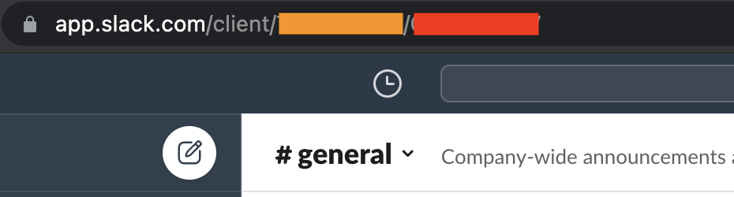

# slackMessageCleaner
Script to clear old messages from slack.

# Why?

I tried clearing the old messages by using a bot with the right permissions. For that to work you have to use the *User OAuth Token* of the bot. This feature is only available for *enterprise users*. Too bad!.

# Slack Token and Channel 

> You will have to run slack in the browser to get the token and channel IDs

## Slack token

1. Open *Developer Tools*. This is under *View > Developer > Developer Tools*
2. Switch to network tab.
3. Click on one of the slack groups on the main browser.
4. Open one of the Slack APIs. If you are not familiar with the Slack APIs, then search for *conversations.history*.
5. Copy the following
   1. From Request Headers > **Cookie**
   2. Form Data > **token**
   3. Form Data > channel

Save the value of **token** and **cookie** under `config.env`

```
USER_TOKEN=xoxc-xxxxxx
USER_COOKIE=xxxx
```

## Slack group id

When you have to find the groupID or conversation id, you don't always have to open the browser Developer tools. Instead, check the URL.



The part in red is the conversation or group ID.

# Setting up the code.

Do `npm install` before running the code.

## Update the channelID in the following places

**Line:7**
```js
const channelDict = {
	C1XXXXXXX: 'general',
	C2XXXXXXX: 'random'
}
```

**Line:73**
```js
await getMessages("C1XXXXXXX", 10)
```

The script fetches the data and runs recursively till all the messages outside the retention period is cleared. In the above case, it will search all messages older than 10 days and deletes them.

## Bots

By default the code removes any message which is of *subtype* **bot_message**.

It also searched for a list if botIds. You can specify the list of botIds here.

**Line:67**

```js
const purgeableBotIDs = [
	"BEXXXXXXX", // myBot
]
```

# Running

Run the app using `node app.js`
